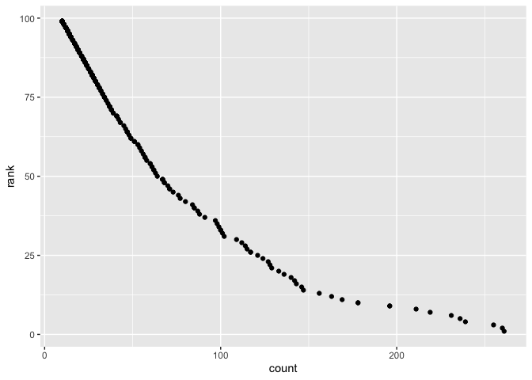

p8105\_hw2\_tb2715
================
Tess
9/24/2019

\#\#Load libraries

``` r
library(tidyverse)
```

    ## ── Attaching packages ──────────────────────── tidyverse 1.2.1 ──

    ## ✔ ggplot2 3.2.1     ✔ purrr   0.3.2
    ## ✔ tibble  2.1.3     ✔ dplyr   0.8.3
    ## ✔ tidyr   1.0.0     ✔ stringr 1.4.0
    ## ✔ readr   1.3.1     ✔ forcats 0.4.0

    ## ── Conflicts ─────────────────────────── tidyverse_conflicts() ──
    ## ✖ dplyr::filter() masks stats::filter()
    ## ✖ dplyr::lag()    masks stats::lag()

``` r
library(readxl)
```

\#\#\#Problem 1

\#Load and clean trash wheel 2019
data

``` r
trash_wheel_2019 = read_excel(path = "./data/Trash-Wheel-Collection-Totals-8-6-19.xlsx", 
                         sheet = "Mr. Trash Wheel",
                         col_names = TRUE)
```

    ## New names:
    ## * `` -> ...15
    ## * `` -> ...16
    ## * `` -> ...17

``` r
tidy_trash_wheel =
  janitor::clean_names(trash_wheel_2019) %>%
  drop_na(dumpster) %>%
  select(-x15, -x16, -x17) %>%
  mutate(sports_balls = as.integer(sports_balls)) 
```

\#Read in precipitation
data

``` r
precipitation_18 = read_excel(path = "./data/HealthyHarborWaterWheelTotals2018-7-28.xlsx", 
  sheet = "2018 Precipitation", 
  skip = 1,
  col_names = TRUE) %>%
  drop_na(Month) %>%
  mutate(Year = "2018")


precipitation_17 = read_excel(path = "./data/HealthyHarborWaterWheelTotals2018-7-28.xlsx", 
  sheet = "2017 Precipitation", 
  skip = 1,
  col_names = TRUE) %>%
  drop_na(Month) %>%
  mutate(Year = "2017")
```

\#Merge precipitation data

``` r
precipitation_data = 
  merge(precipitation_18, precipitation_17, by = "Month") %>%
  mutate(Month = as.character(Month))
#HOW TO USE MONTH.NAME

#OR
precipitation_data_test = 
  bind_rows(precipitation_18, precipitation_17) %>%
  mutate(Year = as.numeric(Year)) %>%
  arrange(Month)
```

WRITE A PARAGRAPH HERE ABOUT DATA

\#\#\#Problem 2

\#upload and clean
pols\_data

``` r
pols_data = read_csv(file = "./data/fivethirtyeight_datasets/pols-month.csv") %>%
  janitor::clean_names() %>% 
  separate(col = mon, into = c("year", "month", "day")) %>%
  mutate(
    month = recode(month, "01" = "January", 
                   "02" = "February", 
                   "03" = "March", 
                   "04" = "April", 
                   "05" = "May", 
                   "06" = "June", 
                   "07" = "July", 
                   "08" = "August", 
                   "09" = "September", 
                   "10" = "October", 
                   "11" = "November", 
                   "12" = "December")) %>%
  mutate(president = recode(prez_dem, `1` = "dem", `0` = "gop"))
```

    ## Parsed with column specification:
    ## cols(
    ##   mon = col_date(format = ""),
    ##   prez_gop = col_double(),
    ##   gov_gop = col_double(),
    ##   sen_gop = col_double(),
    ##   rep_gop = col_double(),
    ##   prez_dem = col_double(),
    ##   gov_dem = col_double(),
    ##   sen_dem = col_double(),
    ##   rep_dem = col_double()
    ## )

``` r
pols_data_tidy = 
  select(pols_data, -prez_gop, -prez_dem, -day)
```

\#upload and clean
snp\_data

``` r
snp_data = read_csv(file = "./data/fivethirtyeight_datasets/snp.csv") %>%
  janitor::clean_names() %>% 
  separate(col = date, into = c("month", "day", "year")) %>%
  mutate(
    month = recode(month, "1" = "January", 
                   "2" = "February", 
                   "3" = "March", 
                   "4" = "April", 
                   "5" = "May", 
                   "6" = "June", 
                   "7" = "July", 
                   "8" = "August", 
                   "9" = "September", 
                   "10" = "October", 
                   "11" = "November", 
                   "12" = "December")) 
```

    ## Parsed with column specification:
    ## cols(
    ##   date = col_character(),
    ##   close = col_double()
    ## )

``` r
snp_data_tidy =
  snp_data[c("year", "month", "close")]
#Is this code okay?!

#snp_data_tidy =
  #snp_data %>%
  #distinct(year, month, close) #this works because there are no duplicates but how to arrange columns otherwise?
```

\#upload and clean
unemployment\_data

``` r
unemployment_data = read_csv(file = "./data/fivethirtyeight_datasets/unemployment.csv") %>%
  janitor::clean_names() 
```

    ## Parsed with column specification:
    ## cols(
    ##   Year = col_double(),
    ##   Jan = col_double(),
    ##   Feb = col_double(),
    ##   Mar = col_double(),
    ##   Apr = col_double(),
    ##   May = col_double(),
    ##   Jun = col_double(),
    ##   Jul = col_double(),
    ##   Aug = col_double(),
    ##   Sep = col_double(),
    ##   Oct = col_double(),
    ##   Nov = col_double(),
    ##   Dec = col_double()
    ## )

``` r
tidy_unemployment_data =
    pivot_longer(
    unemployment_data, 
    jan:dec, 
    names_to = "month", 
    values_to = "unemployed") %>%
  mutate(
    month = recode(month, "jan" = "January", 
                   "feb" = "February", 
                   "mar" = "March", 
                   "apr" = "April", 
                   "may" = "May", 
                   "jun" = "June", 
                   "jul" = "July", 
                   "aug" = "August", 
                   "sep" = "September", 
                   "oct" = "October", 
                   "nov" = "November", 
                   "dec" = "December")) 
```

\#merge data sets

``` r
merge1 = 
  merge(snp_data_tidy, pols_data_tidy, by = c("year","month"))

merge2 = 
  merge(merge1, tidy_unemployment_data, by = c("year","month"))
```

WRITE A PARAGRAPH

\#\#\#Problem 3

\#upload data and clean to demonstrate name rank in a certain year

``` r
baby_name = read_csv(file = "./data/Popular_Baby_Names.csv") %>%
  janitor::clean_names() %>%
  distinct(childs_first_name, ethnicity, year_of_birth, count, rank, gender) 
```

    ## Parsed with column specification:
    ## cols(
    ##   `Year of Birth` = col_double(),
    ##   Gender = col_character(),
    ##   Ethnicity = col_character(),
    ##   `Child's First Name` = col_character(),
    ##   Count = col_double(),
    ##   Rank = col_double()
    ## )

``` r
tidy_baby_name = 
  select(baby_name, -count) 

tidy_baby_name = 
  pivot_wider(
    tidy_baby_name,
    names_from = "year_of_birth", 
    values_from = "rank") 
```

\#filter data to only observe babies named Olivia and rank over time

``` r
olivia_baby =
  filter(tidy_baby_name, childs_first_name == "Olivia") 
```

\#filter data to observe male children name rank over time

``` r
male_baby = 
  filter(tidy_baby_name, gender == "MALE")
```

\#create a new data frame to observe a certain population of males to
use in scatterplot below

``` r
male_plot_df = 
  filter(baby_name, 
         gender == "MALE", 
         ethnicity == "WHITE NON HISPANIC", 
         year_of_birth == "2016")
  
male_plot = 
  ggplot(male_plot_df, aes(x = count, y = rank)) +
  geom_point()

male_plot
```

<!-- -->

\#unused code aggregate(olivia\_baby\[c(“2016”, “2015”, “2014”, “2013”,
“2012”, “2011”)\], by =
list(olivia\_baby\(childs_first_name, olivia_baby\)ethnicity,
olivia\_baby$gender), FUN = “mean”, na.rm = T) \#\#Read in dataset

\#cpi\_data = read\_csv(file =
“./data/fivethirtyeight\_datasets/cpi.csv”)

\#gdp\_data = read\_csv(file =
“./data/fivethirtyeight\_datasets/GDP.csv”)

\#recession\_data = read\_csv(file =
“./data/fivethirtyeight\_datasets/recessions.csv”)

\#UPDATE WITH NEW DATASET INCLUDE 2019 trash\_wheel = read\_excel(path =
“./data/HealthyHarborWaterWheelTotals2018-7-28.xlsx”, sheet = “Mr. Trash
Wheel”, col\_names = TRUE)
